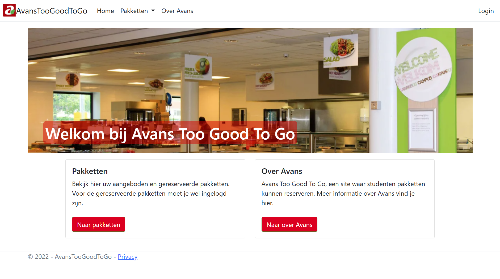

# sswp-TooGoodToGo

Dit project is een serverside toepassing ontwikkeld in **C# (.NET Framework)** en gehost op **Azure**. Het ontwerp volgt de **Onion Architecture** om een modulaire en schaalbare codebasis te garanderen. Er is ook onderzoek gedaan naar het gebruik van **GraphQL** en **Swagger** om het begrip ervan te verbeteren.

## Systeemoverzicht

### Actoren:
- **Studenten**: Registreren met naam, geboortedatum (niet in de toekomst, minimaal 16 jaar), studentnummer, e-mailadres, studiestad en telefoonnummer.
- **Kantinemedewerkers**: Beheren pakketten met naam, personeelsnummer en locatie.

### Pakketten:
Bevatten een beschrijvende naam, indicatieve inhoud, locatie, ophaalmoment, prijs, 18+ indicatie, en maaltijdtype. Ze kunnen gereserveerd worden door studenten.

### Producten:
Hebben een naam, foto en alcoholindicatie.

### Kantines:
Informatie over stad, locatie en beschikbaarheid van warme maaltijden.

## Belangrijke User Stories
- **US_01**: Studenten kunnen beschikbare en gereserveerde pakketten bekijken.
- **US_02**: Medewerkers zien pakketoverzichten van alle locaties.
- **US_05**: Studenten kunnen pakketten reserveren (max. 1 per afhaaldag).
- **US_07**: Geen dubbele reserveringen per pakket.

Bekijk het project hier: [TooGoodToGo op Azure](https://avansapp.azurewebsites.net)
